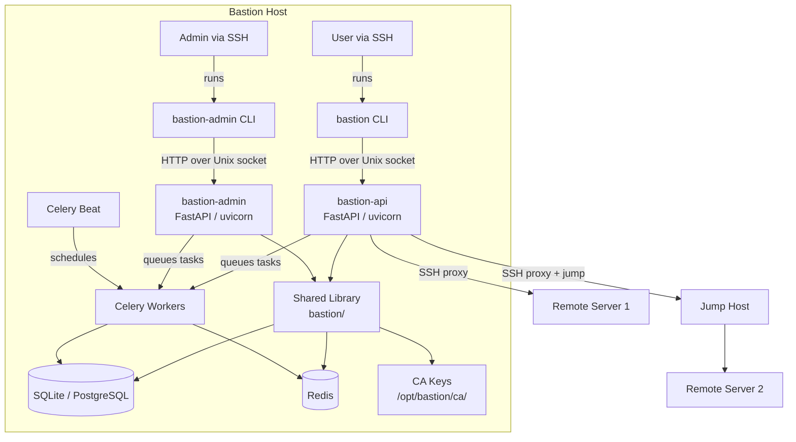
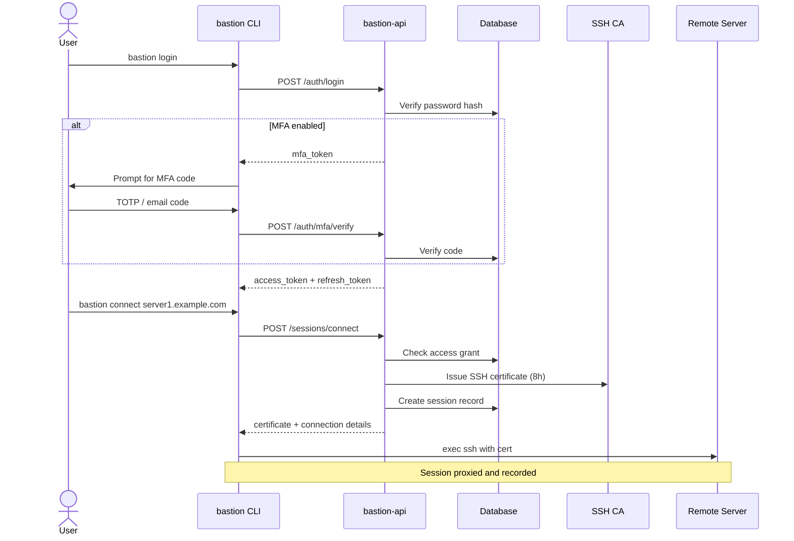
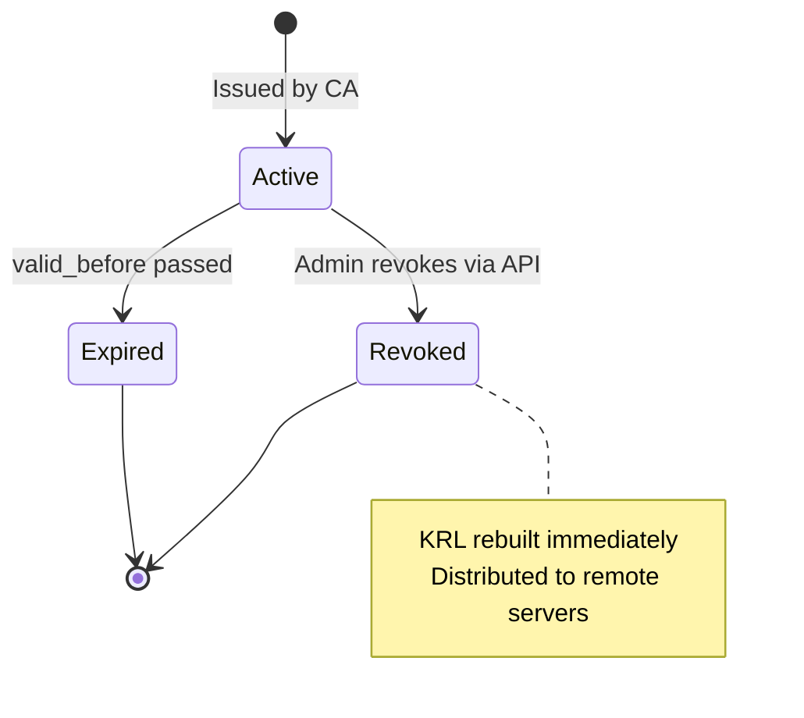
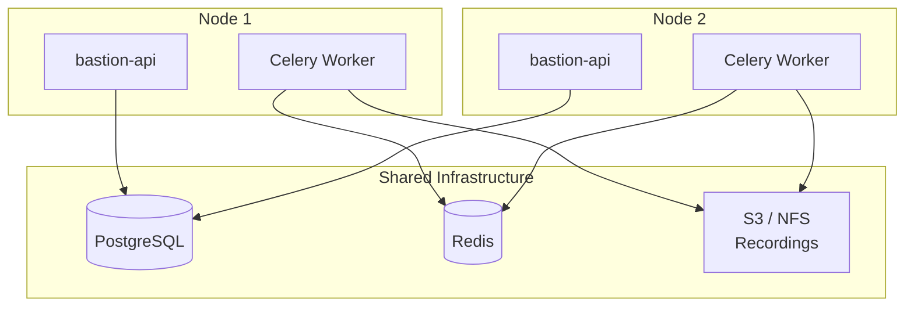

# Bastion

> A secure, auditable SSH bastion/jumphost service with a built-in certificate authority, session recording, remote server management, anomaly detection, and a fully API-driven architecture.

[](https://github.com/disappointingsupernova/bastion/actions/workflows/ci.yml)
[](https://github.com/disappointingsupernova/bastion/actions/workflows/security.yml)
[](LICENSE)
[](https://www.python.org/downloads/)
[](CHANGELOG.md)

---

## Documentation Index

| Document | Description |
|---|---|
| [Architecture](docs/architecture.md) | System design, components, and data flow |
| [Installation](docs/installation.md) | Full installation guide for Ubuntu |
| [Configuration](docs/configuration.md) | All environment variables and settings |
| [API Reference](docs/api.md) | REST API endpoints for both services |
| [CLI Reference](docs/cli.md) | `bastion` and `bastion-admin` command-line tool usage |
| [SSH CA & Certificates](docs/certificates.md) | How the CA works, cert lifecycle, and revocation |
| [Session Recording](docs/recordings.md) | Recording format, encryption, and storage |
| [Anomaly Detection](docs/anomaly.md) | Heuristic scoring and alerting |
| [HA Mode](docs/ha.md) | High-availability deployment with PostgreSQL |
| [Security](docs/security.md) | Security model, hardening, and threat mitigations |

---

## Overview

Bastion is a self-hosted SSH bastion service designed to run on a dedicated Ubuntu server. Users SSH into the bastion host and use the `bastion` CLI to connect to managed remote servers. The bastion sits in the middle of every connection, recording sessions and enforcing access controls.

### Core Principles

- **API-driven** — every action goes through the API. The `bastion` system user handles all file permissions; human users never touch the filesystem directly.
- **Certificate-based auth** — the bastion acts as an SSH CA. Users receive short-lived (8-hour) certificates rather than static keys. Certificates can be revoked instantly via KRL.
- **Zero standing access** — certificates expire automatically. Access is granted per-user, per-server, with optional sudo.
- **Full audit trail** — every action is logged to the database before and after execution.
- **Modular** — each component (crypto, alerting, anomaly detection, provisioning) is a standalone module designed for extension.

---

## Architecture



---

## Services

### `bastion-api`
The user-facing API. Listens on a Unix socket at `/opt/bastion/run/bastion-api.sock`. Accessible to members of the `bastion-users` group.

**Responsibilities:**
- User authentication (password + 2FA)
- JWT token issuance and refresh
- SSH certificate issuance
- Session initiation and management

### `bastion-admin`
The administrative API. Listens on a Unix socket at `/opt/bastion/run/bastion-admin.sock`. Accessible to the `bastion` group only (administrators).

**Responsibilities:**
- User lifecycle management (create, suspend, delete)
- Server onboarding and access grants
- Certificate revocation and KRL management
- Audit log queries
- Alert configuration
- Package update management
- Server provisioning

### `bastion-worker`
Celery worker for background tasks. Handles connectivity checks, package scans, certificate expiry, anomaly alert dispatch, and recording offload.

### `bastion-beat`
Celery beat scheduler. Triggers periodic tasks on configured intervals.

---

## User Roles

| Role | Description |
|---|---|
| `admin` | Full access to all API endpoints |
| `user` | Can authenticate, issue certs, and connect to granted servers |
| `auditor` | Read-only access to audit logs, sessions, and server status |
| `read_only` | Read-only access to user and server listings |

---

## Authentication Flow



---

## SSH Certificate Lifecycle



1. User submits their Ed25519 public key to `/auth/cert/issue`
2. Bastion CA signs it with an 8-hour validity window
3. Certificate is returned in the API response — never written to disk on the server
4. Certificate principals are set to the user's remote username(s)
5. On expiry or revocation, the KRL is rebuilt and distributed to remote servers
6. Remote servers are configured to trust the Bastion CA and check the KRL

---

## Session Recording

Sessions are recorded in [asciinema v2](https://github.com/asciinema/asciinema) format. Each recording captures terminal output with timestamps.

On session completion:
- If `RECORDINGS_AGE_PUBLIC_KEY` is set, the recording is encrypted with `age` (asymmetric, X25519)
- The plaintext file is securely overwritten and deleted
- In HA mode, recordings are offloaded to S3 or NFS via a Celery task

---

## Quick Start

```bash
# On the bastion host, as root:
git clone https://github.com/disappointingsupernova/bastion /opt/bastion-src
cd /opt/bastion-src
bash scripts/install.sh

# Add yourself to the bastion-users group:
usermod -aG bastion-users yourusername

# Log in and connect:
bastion login
bastion connect server1.example.com
```

---

## Directory Structure

```
/opt/bastion/
├── app/                  # Application code (rsync'd from repo)
│   ├── bastion/          # Shared library
│   │   ├── config/       # Settings (pydantic-settings)
│   │   ├── models/       # SQLAlchemy ORM models
│   │   ├── db/           # Database engine and session management
│   │   ├── crypto/       # CA, cert issuance, encryption
│   │   ├── audit/        # Audit logging
│   │   ├── auth.py       # JWT, bcrypt, TOTP, MFA
│   │   ├── anomaly.py    # Heuristic anomaly detection
│   │   ├── alerting.py   # Multi-channel alerting
│   │   ├── proxy.py      # SSH proxy and session recording
│   │   └── provisioning.py # Remote server provisioning
│   ├── bastion_api/      # User-facing FastAPI service
│   ├── bastion_admin/    # Admin FastAPI service
│   ├── cli/              # bastion and bastion-admin CLI tools
│   ├── workers/          # Celery tasks
│   ├── migrations/       # Alembic database migrations
│   └── scripts/          # install.sh, update.sh
├── ca/                   # CA private key (mode 700, bastion user only)
│   ├── bastion_ca        # Ed25519 CA private key — BACK THIS UP
│   ├── bastion_ca.pub    # CA public key — distribute to remote servers
│   └── krl               # Key Revocation List
├── data/                 # Database and Celery beat schedule
├── recordings/           # Session recordings (age-encrypted)
├── run/                  # Unix sockets
│   ├── bastion-api.sock
│   └── bastion-admin.sock
├── logs/                 # Service logs
├── venv/                 # Python virtual environment
└── .env                  # Environment configuration (mode 600)
```

---

## Security Considerations

- Both APIs are Unix socket only — no TCP ports are exposed
- The `bastion` system user owns all application files and has no login shell
- SSH certificates expire after 8 hours by default
- All secrets are encrypted at rest using Fernet (AES-128-CBC + HMAC-SHA256, derived from `SECRET_KEY`)
- Session recordings are encrypted with `age` (X25519 asymmetric encryption)
- Bcrypt cost factor 12 for all password hashes
- Rate limiting on all authentication endpoints
- Anomaly detection with configurable heuristic scoring
- Full audit log of every action, stored in the database
- SSH hardening applied to both the bastion host and remote servers

See [docs/security.md](docs/security.md) for the full security model.

---

## HA Mode



Set `HA_MODE=true` and configure `DB_URL` to point to a shared PostgreSQL instance. All nodes are stateless — the database is the single source of truth. Session recordings must be offloaded to S3 or NFS when HA mode is enabled.

See [docs/ha.md](docs/ha.md) for full HA deployment instructions.

---

## Contributing

See [CONTRIBUTING.md](CONTRIBUTING.md) for development setup, code standards, and the PR process.

## Security

To report a security vulnerability, see [SECURITY.md](SECURITY.md). Please do not open public issues for security bugs.

## Licence

[MIT](LICENSE) © [disappointingsupernova](https://github.com/disappointingsupernova)
