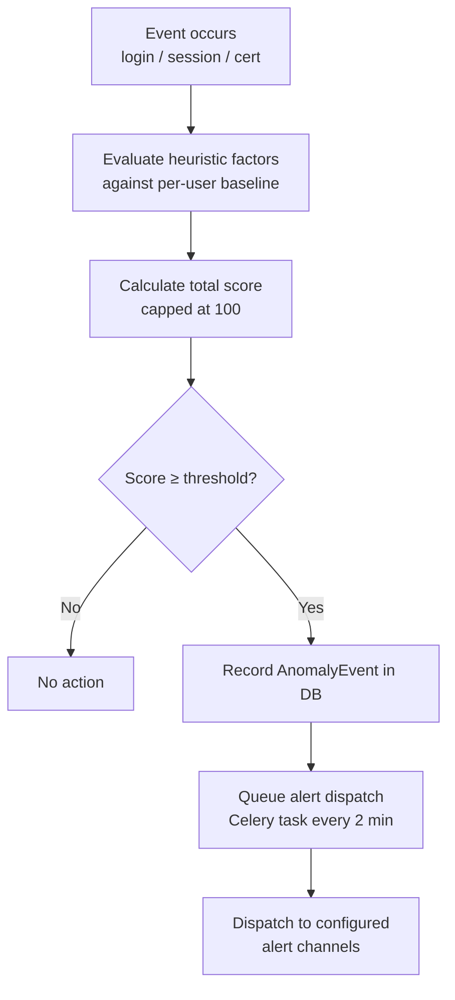

# Anomaly Detection

Bastion includes a heuristic anomaly detection engine that scores every login event, session, and certificate issuance for suspicious behaviour. When the score exceeds the configured threshold, an anomaly event is recorded and an alert is dispatched.

Scores are computed relative to per-user baselines where available, falling back to fixed thresholds for new accounts.

---

## How Scoring Works

Each event is evaluated against a set of heuristic factors. Each factor contributes a fixed number of points to the total score. The final score is capped at 100.

When the score reaches or exceeds `ANOMALY_SCORE_ALERT_THRESHOLD` (default `70`), an `AnomalyEvent` record is created in the database and queued for alert dispatch.



---

## Per-User Baselines

The engine maintains a rolling 30-day baseline per user, updated after every successful login and completed session. The baseline tracks:

- **Typical login hours** — UTC hours seen in successful logins over the last 30 days
- **Known source IPs** — IP addresses seen in successful logins over the last 30 days
- **Average session duration** — exponential moving average (α = 0.1)
- **Average bytes transferred** — exponential moving average (α = 0.1)

When a baseline exists, off-hours and new-IP checks compare against the user's personal history rather than fixed thresholds. Session duration and data transfer anomalies are scored relative to the user's own average.

Baselines are also refreshed on a 6-hour schedule by the `refresh_anomaly_baselines` Celery task.

---

## Scoring Factors

### Login Events

| Factor | Event Type | Score | Condition |
|---|---|---|---|
| Failed auth burst | `anomaly.failed_auth_burst` | +40 | ≥5 failed login attempts in the last 10 minutes |
| Off-hours login | `anomaly.off_hours` | +20 | Login outside the user's typical hours (baseline), or between 22:00–06:00 UTC if no baseline |
| New source IP | `anomaly.new_ip` | +25 | IP not seen in the user's 30-day baseline, or first login from this IP ever |
| Concurrent sessions | `anomaly.concurrent_sessions` | +30 | User has more than 3 active sessions |
| Weekend access | `anomaly.weekend_access` | +15 | Login on Saturday or Sunday |
| First login ever | `anomaly.first_login_ever` | +10 | First successful login for this account |
| Dormant account | `anomaly.dormant_account_login` | +35 | Account had no login in the last 90 days |
| Multiple failed server attempts | `anomaly.multiple_failed_server_attempts` | +40 | ≥3 denied server connection attempts in 10 minutes |

### Session Events

| Factor | Event Type | Score | Condition |
|---|---|---|---|
| High data transfer | `anomaly.high_data_transfer` | +35 | Transfer significantly above user's baseline average, or >500 MB if no baseline |
| Long session | `anomaly.long_session` | +20 | Duration significantly above user's baseline average, or >8 hours if no baseline |
| Session outside typical hours | `anomaly.session_outside_hours` | +25 | Session started outside the user's typical hours (baseline-aware) |

### Certificate Issuance

| Factor | Event Type | Score | Condition |
|---|---|---|---|
| Rapid cert issuance | `anomaly.rapid_cert_issuance` | +45 | More than 3 certificates issued for this user in the last 5 minutes |

---

## Baseline-Aware Scoring

For data transfer and session duration, the score is scaled by how far the observed value deviates from the user's baseline:

- At or below baseline: 0 points
- Between 1× and 3× baseline: linearly scaled up to the full factor score
- Above 3× baseline: full factor score

This means a user who regularly transfers large amounts of data will not be flagged for a session that is within their normal range.

---

## Alert Severity

| Score | Severity |
|---|---|
| Threshold–79 | `warning` |
| 80–100 | `critical` |

---

## Anomaly Events

Anomaly events are stored in the `anomaly_events` table and include:

- The user and/or server involved
- The session ID (if applicable)
- The event type (e.g. `anomaly.failed_auth_burst`)
- The total score
- A JSON detail object listing the contributing factors and source IP
- Whether an alert has been dispatched (`alerted`)
- Whether the event has been resolved (`resolved`)

Anomaly events are visible via the admin health dashboard and the audit log.

---

## Tuning the Threshold

The default threshold of `70` is appropriate once per-user baselines are established. During initial deployment (before baselines exist), consider lowering the threshold to `40`–`50` to catch events that would otherwise be missed.

```env
# More sensitive — alert on any two moderate factors
ANOMALY_SCORE_ALERT_THRESHOLD=40

# Less sensitive — only alert on severe combinations
ANOMALY_SCORE_ALERT_THRESHOLD=85
```

---

## Alert Dispatch

Anomaly alerts are dispatched by the `alerts.dispatch_pending_anomaly_alerts` Celery task, which runs every 2 minutes. The alert body includes:

- The anomaly score
- The event type
- The source IP address
- A list of all contributing factors

Example alert body:

```
Anomaly score: 85/100
Event type: anomaly.failed_auth_burst
Source IP: 203.0.113.42

Contributing factors:
  - Failed login burst: 7 attempts in 10 minutes
  - Login outside business hours (UTC 02:xx)
  - First login from IP 203.0.113.42
  - (3 factors total)
```

---

## Extending the Engine

The anomaly engine is in `bastion/anomaly.py`. Adding a new factor requires:

1. Define an event type constant (`ET_*`) and score constant (`SCORE_*`) at the top of the file
2. Add the evaluation logic to the appropriate `evaluate_*` function
3. Append a tuple of `(score, event_type, [factor_description])` to the `events` list

Example — adding a check for logins from a new country:

```python
ET_NEW_COUNTRY = "anomaly.new_country"
SCORE_NEW_COUNTRY = 30


async def evaluate_login(db, user, source_ip, success):
    ...
    if success:
        country = await _geoip_lookup(source_ip)
        prior_countries = await _get_prior_countries(db, user.id)
        if country and country not in prior_countries:
            events.append(
                (SCORE_NEW_COUNTRY, ET_NEW_COUNTRY, [f"First login from country: {country}"])
            )
    ...
```
