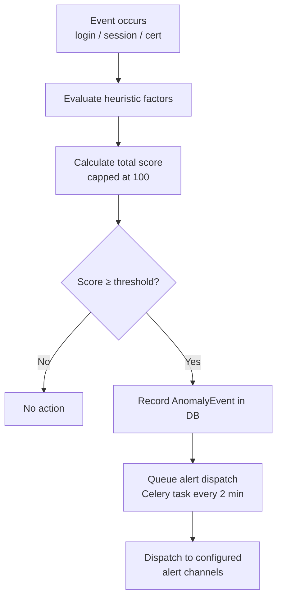
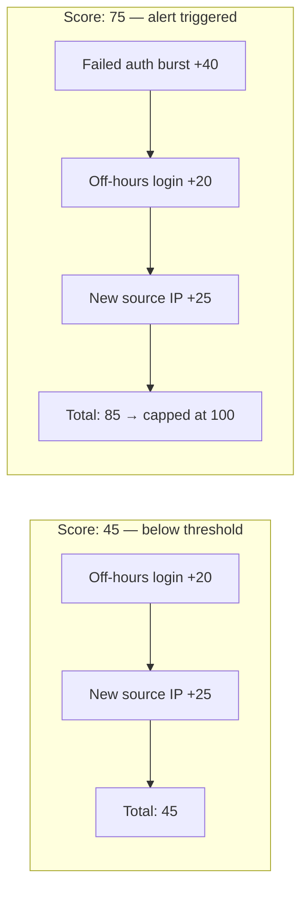

# Anomaly Detection

Bastion includes a heuristic anomaly detection engine that scores every login event, session, and certificate issuance for suspicious behaviour. When the score exceeds the configured threshold, an anomaly event is recorded and an alert is dispatched.

---

## How Scoring Works

Each event is evaluated against a set of heuristic factors. Each factor contributes a fixed number of points to the total score. The final score is capped at 100.

When the score reaches or exceeds `ANOMALY_SCORE_ALERT_THRESHOLD` (default `70`), an `AnomalyEvent` record is created in the database and queued for alert dispatch.



---

## Scoring Factors

### Login Events

| Factor | Score | Condition |
|---|---|---|
| Failed auth burst | +40 | ≥5 failed login attempts in the last 10 minutes for this user |
| Off-hours login | +20 | Successful login between 22:00 and 06:00 UTC |
| New source IP | +25 | First successful login from this IP address for this user |
| Concurrent sessions | +30 | User has more than 3 active sessions at the time of login |

### Session Events

| Factor | Score | Condition |
|---|---|---|
| High data transfer | +35 | Session transferred more than 500 MB (sent + received) |

### Certificate Issuance

| Factor | Score | Condition |
|---|---|---|
| Rapid cert issuance | +45 | More than 3 certificates issued for this user in the last 5 minutes |

---

## Score Examples



---

## Alert Severity

| Score | Severity |
|---|---|
| 70–79 | `warning` |
| 80–100 | `critical` |

---

## Anomaly Events

Anomaly events are stored in the `anomaly_events` table and include:

- The user and/or server involved
- The session ID (if applicable)
- The event type (e.g. `anomaly.login`, `anomaly.session`)
- The total score
- A JSON detail object listing the contributing factors and source IP
- Whether an alert has been dispatched
- Whether the event has been resolved

### Querying anomaly events

Anomaly events are visible in the audit log and will be exposed via a dedicated admin API endpoint in a future release.

---

## Tuning the Threshold

The default threshold of `70` is a reasonable starting point. Lower values increase sensitivity (more alerts, more false positives). Higher values reduce noise but may miss genuine threats.

```env
# More sensitive — alert on any two moderate factors
ANOMALY_SCORE_ALERT_THRESHOLD=40

# Less sensitive — only alert on severe combinations
ANOMALY_SCORE_ALERT_THRESHOLD=85
```

---

## Extending the Engine

The anomaly engine is in `bastion/anomaly.py`. Adding a new factor requires:

1. Define a score constant at the top of the file
2. Add the evaluation logic to the appropriate `evaluate_*` function
3. Append the factor description to the `factors` list

Example — adding a check for logins from a new country:

```python
SCORE_NEW_COUNTRY = 30


async def evaluate_login(db, user, source_ip, success):
    ...
    if success:
        country = await _geoip_lookup(source_ip)
        prior_countries = await _get_prior_countries(db, user.id)
        if country and country not in prior_countries:
            score += SCORE_NEW_COUNTRY
            factors.append(f"First login from country: {country}")
    ...
```

---

## Alert Dispatch

Anomaly alerts are dispatched by the `alerts.dispatch_pending_anomaly_alerts` Celery task, which runs every 2 minutes. The alert body includes:

- The anomaly score
- The event type
- The source IP address
- A list of all contributing factors

Example alert body:

```
Anomaly score: 85/100
Event type: anomaly.login
Source IP: 203.0.113.42

Contributing factors:
  - Failed login burst: 7 attempts in 10 minutes
  - Login outside business hours (UTC 02:xx)
  - First login from IP 203.0.113.42
```
