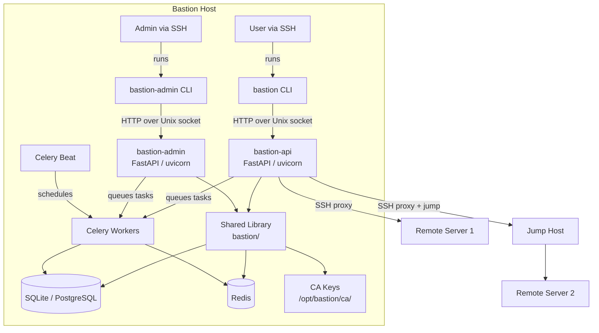
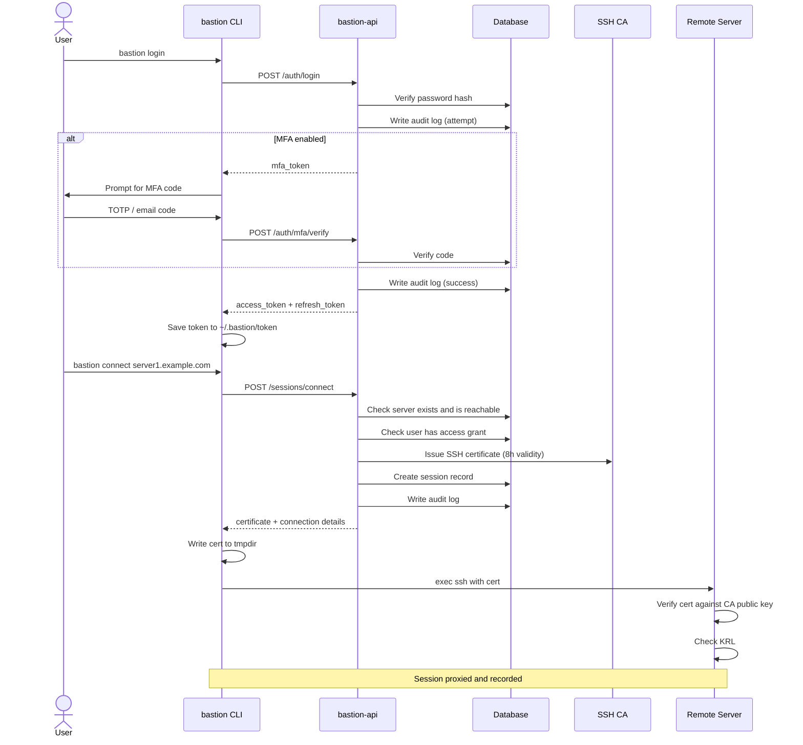
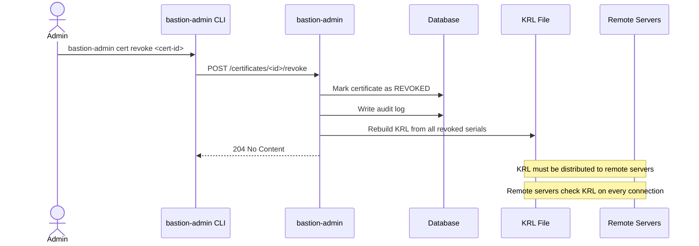
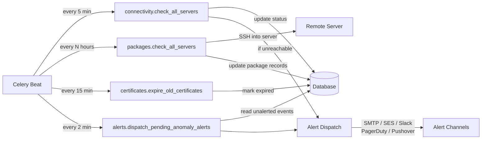
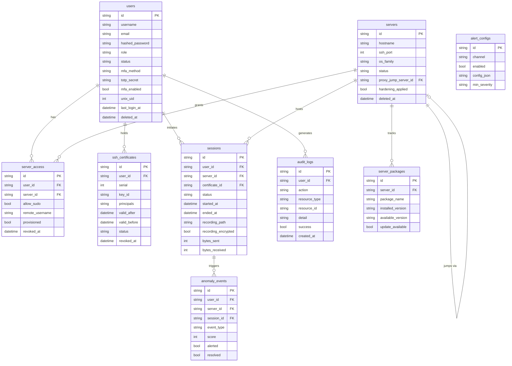
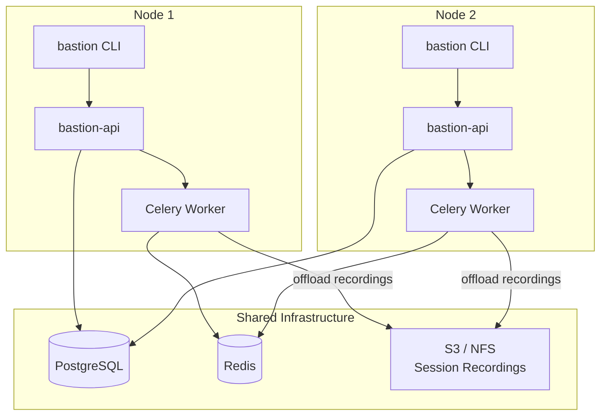

# Architecture

This document describes the system design, component responsibilities, and data flow of the Bastion service.

---

## System Overview

Bastion is a self-hosted SSH bastion/jumphost service. It runs on a dedicated Ubuntu server and acts as the single point of entry for all SSH connections to managed remote servers. Every connection is proxied through the bastion, recorded, and audited.

The system is split into two API services, a shared library, a CLI tool, and a set of background workers. All communication between the CLI and the APIs happens over Unix sockets — no TCP ports are exposed.

---

## High-Level Architecture



---

## Component Responsibilities

### `bastion-api`

The user-facing API service. Listens on `/opt/bastion/run/bastion-api.sock`. Only members of the `bastion-users` group can reach this socket.

| Responsibility | Detail |
|---|---|
| Authentication | Password verification, JWT issuance, MFA flow |
| Certificate issuance | Signs user public keys with the CA, returns cert in response |
| Session management | Creates session records, initiates SSH proxy connections |
| Anomaly evaluation | Scores every login and session for suspicious behaviour |

### `bastion-admin`

The administrative API service. Listens on `/opt/bastion/run/bastion-admin.sock`. Only members of the `bastion` group (administrators) can reach this socket.

| Responsibility | Detail |
|---|---|
| User lifecycle | Create, update, suspend, soft-delete users |
| Server management | Onboard servers, configure proxy jumps, soft-delete |
| Access control | Grant and revoke per-user, per-server access with optional sudo |
| Certificate revocation | Revoke certs by ID, rebuild KRL |
| Audit queries | Read-only access to the full audit trail |
| Package management | View available updates, queue update tasks |
| Provisioning | Queue user provisioning and SSH hardening tasks |

### `bastion-worker`

Celery worker processes. Handle all background and long-running tasks.

| Task | Schedule |
|---|---|
| Connectivity checks | Every 5 minutes |
| Package update scans | Every N hours (configurable) |
| Certificate expiry | Every 15 minutes |
| Anomaly alert dispatch | Every 2 minutes |
| Recording offload (HA) | On-demand, triggered after session completion |

### `bastion-beat`

Celery beat scheduler. Triggers periodic tasks on the configured intervals. Stores its schedule in `/opt/bastion/data/celerybeat-schedule`.

### Shared Library (`bastion/`)

All business logic lives here. Both API services and the workers import from this library.

```
bastion/
├── config/         Settings — pydantic-settings, loaded from .env
├── db/             Async SQLAlchemy engine and session management
├── models/         ORM models for all entities
├── crypto/
│   ├── ca.py       SSH CA — key generation, cert issuance, KRL
│   └── encryption.py  age encryption, Fernet secrets at rest
├── audit/          Audit log writer
├── auth.py         JWT, bcrypt, TOTP, email MFA
├── anomaly.py      Heuristic anomaly scoring
├── alerting.py     Multi-channel alert dispatch
├── proxy.py        SSH proxy and asciinema session recording
└── provisioning.py Remote server provisioning over SSH
```

---

## Data Flow — User Login and Connection



---

## Data Flow — Certificate Revocation



---

## Data Flow — Background Workers



---

## Database Schema



---

## Security Boundaries

```mermaid
graph TB
    subgraph Internet
        EXT[External Traffic]
    end

    subgraph Bastion Host
        subgraph SSH Layer
            SSHD[sshd\nport 22\nbastion-users group only]
        end

        subgraph User Space
            CLI[bastion CLI\nruns as logged-in user]
            ACLI[bastion-admin CLI\nruns as admin user]
        end

        subgraph Unix Sockets
            USOCK[bastion-api.sock\nmode 660\nbastion-users group]
            ASOCK[bastion-admin.sock\nmode 660\nbastion group only]
        end

        subgraph Service Layer
            BAPI[bastion-api\nruns as bastion user]
            AAPI[bastion-admin\nruns as bastion user]
        end

        subgraph Data Layer
            DB[(Database\nmode 700)]
            CA[CA Keys\nmode 700]
            REC[Recordings\nmode 750]
        end
    end

    EXT -->|blocked — no open ports| Bastion Host
    SSHD -->|authenticated SSH session| CLI
    SSHD -->|authenticated SSH session| ACLI
    CLI --> USOCK
    ACLI --> ASOCK
    USOCK --> BAPI
    ASOCK --> AAPI
    BAPI --> DB
    BAPI --> CA
    BAPI --> REC
    AAPI --> DB
    AAPI --> CA
```

---

## HA Architecture

In HA mode, multiple bastion nodes share a single PostgreSQL database. All nodes are stateless — the database is the single source of truth.



See [ha.md](ha.md) for full deployment instructions.
