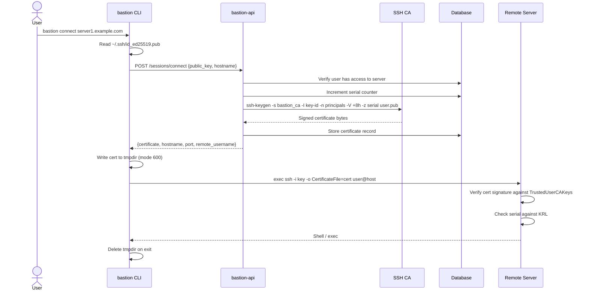
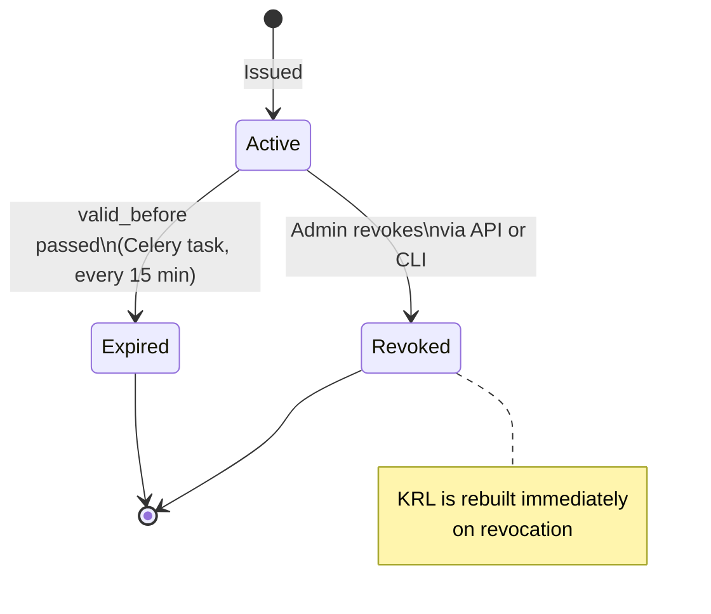

# SSH CA & Certificates

Bastion acts as its own SSH Certificate Authority. Rather than managing `authorized_keys` files on remote servers, all authentication is handled via short-lived signed certificates that are trusted by the CA.

---

## How It Works



---

## Certificate Properties

Each issued certificate has the following properties:

| Property | Value |
|---|---|
| Key type | Ed25519 (user must provide an Ed25519 public key) |
| Certificate type | SSH user certificate |
| Validity | 8 hours by default (configurable via `SSH_CERT_VALIDITY_HOURS`) |
| Principals | Set to the user's remote username on the target server |
| Key ID | `bastion-<username>-<serial>` |
| Serial | Monotonically increasing, stored in the database |
| Extensions | `permit-pty`, `permit-user-rc` |

---

## CA Key Management

The CA uses an Ed25519 keypair stored at `/opt/bastion/ca/`:

```
/opt/bastion/ca/
├── bastion_ca        Ed25519 private key — mode 600, bastion user only
├── bastion_ca.pub    Ed25519 public key — mode 644, distribute to remote servers
└── krl               Key Revocation List — mode 644
```

The private key is generated during installation and is never transmitted over the network. It is only ever read by the `bastion` system user.

### Backing up the CA key

The CA private key is the most critical secret in the system. If it is lost, all issued certificates become unverifiable and you must regenerate the CA and redistribute the public key to all remote servers.

```bash
# Back up the CA private key to a secure location
sudo cat /opt/bastion/ca/bastion_ca
```

Store this in a password manager, encrypted USB drive, or secrets manager.

---

## Remote Server Configuration

For a remote server to accept Bastion-issued certificates, it must be configured to trust the CA public key and check the KRL.

The bastion provisioning module handles this automatically. For manual configuration:

### 1. Install the CA public key

```bash
# On the remote server, as root:
cat > /etc/ssh/bastion_ca.pub << 'EOF'
ssh-ed25519 AAAA... bastion-ca
EOF
chmod 644 /etc/ssh/bastion_ca.pub
```

### 2. Configure sshd

Add to `/etc/ssh/sshd_config.d/99-bastion.conf`:

```
TrustedUserCAKeys /etc/ssh/bastion_ca.pub
```

### 3. Configure KRL checking

The KRL must be distributed to remote servers and checked on every connection. Add to the sshd config:

```
RevokedKeys /etc/ssh/bastion_krl
```

The KRL file must be kept up to date. The bastion provisioning module handles distribution. For manual distribution:

```bash
# Copy the KRL to the remote server
scp /opt/bastion/ca/krl root@server1.example.com:/etc/ssh/bastion_krl
chmod 644 /etc/ssh/bastion_krl
```

### 4. Restart sshd

```bash
sshd -t && systemctl restart sshd
```

---

## Certificate Lifecycle



---

## Certificate Revocation

Certificates are revoked by serial number using a Key Revocation List (KRL). The KRL is a binary file that remote servers check on every connection attempt.

### Revoking a certificate

```bash
bastion-admin cert revoke <cert-id> --reason "User account compromised"
```

This:
1. Marks the certificate as `REVOKED` in the database
2. Rebuilds the KRL from all revoked certificate serials
3. Writes the new KRL to `/opt/bastion/ca/krl`

The KRL must then be distributed to all remote servers. This is handled by the provisioning module, or can be done manually:

```bash
for server in server1.example.com server2.example.com; do
    scp /opt/bastion/ca/krl root@${server}:/etc/ssh/bastion_krl
done
```

### Revoking all certificates for a user

When a user is suspended or deleted, all their active certificates should be revoked:

```bash
# List active certs for the user
bastion-admin cert list --user alice --status active

# Revoke each one
bastion-admin cert revoke <cert-id> --reason "User account suspended"
```

---

## Security Considerations

- Certificates are **never written to disk** on the bastion server — they are returned in the API response and written to a temporary directory by the CLI, which is deleted on exit
- The CA private key is readable only by the `bastion` system user (mode `600`)
- Certificate validity is short (8 hours by default) to limit the window of exposure if a certificate is compromised
- The KRL provides immediate revocation — a revoked certificate is rejected on the next connection attempt, even within its validity window
- Certificate serials are monotonically increasing and stored in the database, making it impossible to issue duplicate serials
- All certificate issuance and revocation events are written to the audit log
