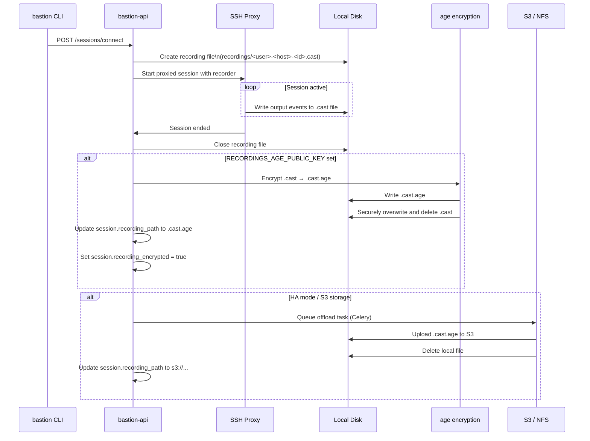

# Session Recording

Every SSH session proxied through Bastion is recorded in [asciinema v2](https://github.com/asciinema/asciinema) format. Recordings capture all terminal output with precise timestamps, allowing full session replay.

---

## Recording Format

Recordings use the [asciinema v2 format](https://github.com/asciinema/asciinema/blob/master/doc/asciicast-v2.md) — a newline-delimited JSON file.

**Header line:**
```json
{"version": 2, "width": 220, "height": 50, "timestamp": 1705329000, "title": "Bastion session — 2024-01-15T14:30:00+00:00"}
```

**Event lines:**
```json
[0.123456, "o", "Last login: Mon Jan 15 14:29:00 2024\r\n"]
[0.456789, "o", "alice@server1:~$ "]
[2.891234, "o", "ls -la\r\n"]
```

Each event is a JSON array of `[elapsed_seconds, type, data]`. The type is always `"o"` (output) — input is not recorded to avoid capturing passwords.

---

## Recording Lifecycle



---

## Encryption

Recordings are encrypted using [age](https://age-encryption.org/) — a modern, simple file encryption tool using X25519 asymmetric encryption.

Asymmetric encryption means:
- The bastion can **encrypt** recordings using only the public key
- Recordings can only be **decrypted** with the corresponding private key
- The private key never needs to be on the bastion host
- Even if the bastion host is compromised, recordings cannot be decrypted without the private key

### Generating a keypair

```bash
age-keygen -o bastion-recordings.key
# Public key: age1ql3z7hjy54pw3hyww5ayyfg7zqgvc7w3j2elw8zmrj2kg5sfn9aqmcac8p
```

- Set `RECORDINGS_AGE_PUBLIC_KEY` in `.env` to the public key (`age1...` string)
- Store `bastion-recordings.key` securely offline — this is required to decrypt recordings

### Decrypting a recording

```bash
age --decrypt -i bastion-recordings.key \
    -o session.cast \
    /opt/bastion/recordings/alice-server1-abc12345.cast.age
```

### Replaying a recording

```bash
asciinema play session.cast
```

---

## Storage

### Local storage (default)

Recordings are stored at `/opt/bastion/recordings/`. The directory is owned by the `bastion` user with mode `750`.

File naming convention:
```
<username>-<hostname>-<session-id-prefix>.cast
<username>-<hostname>-<session-id-prefix>.cast.age  (if encrypted)
```

### S3 storage

Set `RECORDINGS_STORAGE=s3` and `RECORDINGS_S3_BUCKET=your-bucket-name`. After a session completes, a Celery task uploads the recording to S3 and deletes the local file.

```env
RECORDINGS_STORAGE=s3
RECORDINGS_S3_BUCKET=my-bastion-recordings
RECORDINGS_S3_PREFIX=bastion/recordings/
```

S3 uses the standard AWS credential chain. Ensure the `bastion` user's IAM role or instance profile has `s3:PutObject` permission on the bucket.

### NFS storage

Mount an NFS share at `/opt/bastion/recordings/` before starting the services. Set `RECORDINGS_STORAGE=nfs`. No additional configuration is required — recordings are written directly to the NFS mount.

---

## Disabling Recording

To disable session recording entirely:

```env
RECORDINGS_ENABLED=false
```

Individual users or servers cannot selectively disable recording — it is an all-or-nothing setting. This is intentional.

---

## HA Mode

In HA mode, local recording storage is not permitted — recordings must be offloaded to S3 or NFS so that all nodes can access them. The service will refuse to start in HA mode with `RECORDINGS_STORAGE=local`.

---

## Accessing Recordings

Recordings are referenced in the session record by path. Admins and auditors can query session records via the audit API to find recording paths.

Direct access to recording files requires membership of the `bastion` group (admin) or direct filesystem access as the `bastion` user.

Future versions will include a recording playback API endpoint.
