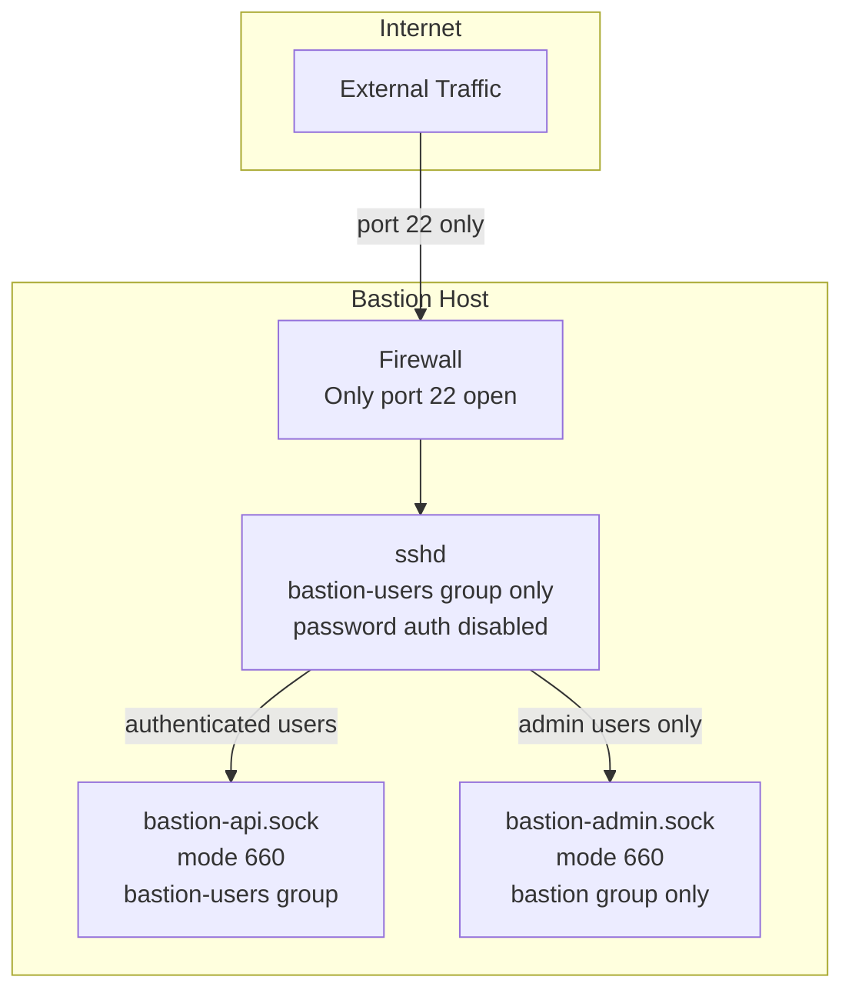
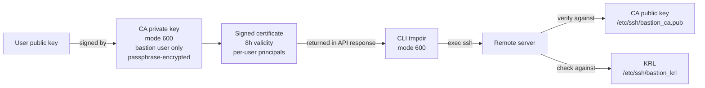

# Security

This document describes the security model, design decisions, and threat mitigations in the Bastion service.

---

## Security Principles

1. **No direct filesystem access** — human users never touch `/opt/bastion/` directly. All operations go through the API. The `bastion` system user owns everything.
2. **No standing access** — SSH certificates expire after 8 hours. There are no permanent `authorized_keys` entries on remote servers.
3. **Least privilege** — users are granted access per-server, not globally. Sudo is opt-in per access grant.
4. **Defence in depth** — multiple independent controls protect each resource.
5. **Full auditability** — every action is logged before and after execution with a tamper-evident HMAC chain.

---

## Network Security



- Both APIs listen on Unix sockets only — no TCP ports are exposed
- The firewall should allow only port 22 inbound
- All other ports should be blocked at the network level

---

## Authentication Security

### Password hashing

All passwords are hashed with bcrypt at cost factor 12. This is deliberately slow to resist brute-force attacks.

### JWT tokens

- Access tokens expire after 60 minutes (configurable)
- Refresh tokens expire after 7 days (configurable)
- Tokens are signed with HMAC-SHA256 (`HS256`) using the `SECRET_KEY`
- The algorithm is fixed to `HS256` — it cannot be overridden via configuration; the service rejects any other value at startup
- The `SECRET_KEY` must be at least 32 bytes; the service rejects shorter values at startup

### MFA

Three MFA methods are supported:

| Method | Security |
|---|---|
| TOTP | Time-based one-time passwords (RFC 6238). Compatible with any authenticator app. The TOTP secret is encrypted at rest using Fernet. A 30-second window is allowed. |
| Email | 6-digit codes with a 10-minute expiry. Codes are stored as HMAC-SHA256 hashes keyed to the user ID — the plaintext is never persisted. |
| FIDO2 / WebAuthn | Hardware security key authentication (phishing-resistant). Credentials are stored encrypted in the database. Sign count validation detects cloned authenticators. The registration challenge is bound to the response via a signed JWT state token — replay of any valid attestation response is rejected. |

### Account lockout

After 10 consecutive failed login attempts, the account is locked for 15 minutes. The lockout threshold and duration are hardcoded constants in the auth router.

### Rate limiting

Authentication endpoints are rate-limited to 10 requests per minute per IP address (configurable via `RATE_LIMIT_AUTH_PER_MINUTE`). Exceeding the limit returns `429 Too Many Requests`.

---

## SSH Certificate Security



- Certificates are **never written to disk** on the bastion server
- The CA private key is readable only by the `bastion` system user (mode `600`) and is encrypted with a passphrase set via `CA_KEY_PASSPHRASE`
- The passphrase is passed to `ssh-keygen` via stdin at signing time — the key is never decrypted to disk and `ssh-keygen` never hangs waiting for interactive input
- Certificates expire after 8 hours — there is no permanent access
- The KRL provides immediate revocation — a revoked certificate is rejected on the next connection attempt
- Certificate principals are scoped to the specific remote username, not a wildcard
- Host certificates are also supported, allowing remote servers to prove their identity using the Bastion CA

---

## Secrets at Rest

All secrets stored in the database (TOTP secrets, FIDO2 credentials, alert channel configuration) are encrypted using Fernet (AES-128-CBC + HMAC-SHA256). The encryption key is derived from `SECRET_KEY` using PBKDF2-HMAC-SHA256 with 600,000 iterations and a per-installation salt derived via HMAC-SHA256.

Alert channel configuration (SMTP passwords, Slack webhook URLs, PagerDuty keys) is stored encrypted and decrypted at dispatch time — never stored or read as plaintext.

The `SECRET_KEY` itself is stored only in `/opt/bastion/.env` (mode `600`, owned by `bastion`). A minimum length of 32 bytes is enforced at startup.

---

## Session Recording Security

- Recordings are stored at `/opt/bastion/recordings/` (mode `750`, owned by `bastion`)
- If `RECORDINGS_AGE_PUBLIC_KEY` is set, recordings are encrypted with `age` (X25519 asymmetric encryption) immediately on session completion
- The plaintext recording file is overwritten with random bytes before deletion (best-effort; SSD wear-levelling means this is not guaranteed — the primary protection is age encryption)
- The `age` private key is never stored on the bastion host — it is held offline by the operator
- The age identity is passed to the playback API via the `X-Age-Identity` request header, not the request body, to prevent capture by request-body logging middleware
- Even if the bastion host is fully compromised, recordings cannot be decrypted without the offline private key
- All recording decryption events are logged in the `recording_decrypt_logs` table with the admin's key fingerprint
- A master key (`RECORDINGS_MASTER_KEY`) can be configured to derive per-admin decrypt keys server-side, avoiding the need to transmit private keys over the API

---

## Remote Server Security

The bastion provisioning module applies the following hardening to remote servers:

```
PermitRootLogin no
PasswordAuthentication no
ChallengeResponseAuthentication no
X11Forwarding no
AllowGroups bastion-users
TrustedUserCAKeys /etc/ssh/bastion_ca.pub
AuthorizedPrincipalsCommand /usr/bin/bastion-principals %u
AuthorizedPrincipalsCommandUser nobody
```

Additionally:
- Users are created with no password (SSH cert auth only)
- Sudo is granted only where explicitly configured, using a per-user sudoers drop-in file
- The `bastion-users` group is required for SSH access
- The KRL is distributed to all managed servers automatically after every revocation and on a 30-minute schedule

All SSH connections from the bastion to remote servers use CA-based host verification (`@cert-authority`) rather than `known_hosts=None`, preventing MITM attacks on managed servers. This applies to provisioning, KRL distribution, and package update tasks. The dedicated `bastion_host_key` is used for SSH client authentication — the CA signing key is never used to authenticate SSH sessions.

---

## Bastion Host Hardening

The install script applies the following to the bastion host's sshd:

```
PermitRootLogin prohibit-password
PasswordAuthentication no
MaxAuthTries 3
LoginGraceTime 30
X11Forwarding no
AllowGroups bastion-users root
LogLevel VERBOSE
```

Additional recommended hardening (not applied automatically):

```bash
# Disable unused services
systemctl disable --now avahi-daemon cups bluetooth

# Configure UFW
ufw default deny incoming
ufw default allow outgoing
ufw allow 22/tcp
ufw enable

# Automatic security updates
apt-get install -y unattended-upgrades
dpkg-reconfigure -plow unattended-upgrades
```

---

## Audit Trail

Every action in the system is written to the `audit_logs` table. Each entry is signed with an HMAC-SHA256 that chains to the previous entry's hash, forming a tamper-evident append-only log. Any modification to a past entry breaks the chain from that point forward.

Audit log entries are immutable — they are never updated or deleted.

Logged actions include:

| Action | Description |
|---|---|
| `auth.login` | Login attempt (success or failure) |
| `auth.login.mfa_required` | MFA challenge issued |
| `auth.mfa.verify` | MFA code verification |
| `auth.totp.setup` | TOTP secret generated |
| `auth.totp.verify` | TOTP activation confirmed |
| `auth.fido2.register` | FIDO2 credential registered |
| `auth.fido2.authenticate` | FIDO2 authentication completed |
| `cert.issue` | SSH certificate issued |
| `session.connect` | SSH session initiated |
| `session.connect.denied` | Access denied to a server |
| `session.terminate` | Session terminated by user |
| `admin.user.create` | User account created |
| `admin.user.update` | User account updated |
| `admin.user.suspend` | User account suspended |
| `admin.user.delete` | User account soft-deleted |
| `admin.server.onboard` | Server onboarded |
| `admin.server.access.grant` | Access grant created |
| `admin.server.access.revoke` | Access grant revoked |
| `admin.server.provision` | Provisioning task queued |
| `admin.server.reboot` | Reboot task queued |
| `admin.server.packages.update` | Package update task queued |
| `admin.cert.revoke` | Certificate revoked |
| `admin.cert.host.issue` | Host certificate issued |
| `admin.session.terminate` | Session forcibly terminated by admin |
| `admin.session.tail` | Admin began live session tail |
| `admin.session.playback` | Session recording decrypted and streamed |
| `admin.compliance.report.download` | Compliance report downloaded |
| `admin.compliance.report.email` | Compliance report emailed |
| `admin.import.users.csv` | Bulk CSV user import |
| `admin.import.users.ldap_sync` | LDAP directory sync |
| `access_request.create` | JIT access request submitted |
| `access_request.approve` | JIT access request approved |
| `access_request.deny` | JIT access request denied |
| `dual_approval.approve` | Dual-approval request approved |
| `dual_approval.reject` | Dual-approval request rejected |

---

## Dual Approval

When `DUAL_APPROVAL_REQUIRED=true`, privileged actions (granting sudo, revoking certificates, deleting users) require a second admin to approve within the configured window (`DUAL_APPROVAL_WINDOW_MINUTES`, default 30).

When only one admin exists, the initiating admin must re-authenticate with TOTP + email MFA before the action proceeds (single-admin fallback).

---

## Just-in-Time Access

Users with `jit_access_enabled=true` on their account can submit time-limited access requests. Admins approve or deny. Approved access auto-revokes at the configured expiry via a Celery task that runs every 5 minutes.

---

## Anomaly Detection

Every login, session, and certificate issuance is scored against a set of heuristic factors. When the score reaches `ANOMALY_SCORE_ALERT_THRESHOLD` (default 70), an anomaly event is recorded and an alert is dispatched. Scores are computed relative to per-user baselines where available.

See [anomaly.md](anomaly.md) for full details.

---

## Threat Model

| Threat | Mitigation |
|---|---|
| Compromised user credentials | MFA (TOTP, email, FIDO2), short-lived certs, anomaly detection, account lockout |
| Stolen SSH certificate | 8h expiry, KRL revocation, cert never written to bastion disk |
| Compromised bastion host | age-encrypted recordings (offline key), CA key passphrase-encrypted, audit log in DB |
| Privilege escalation on bastion | `bastion` user has no login shell, `NoNewPrivileges=yes` in systemd units |
| Lateral movement to remote servers | Per-user, per-server access grants, cert principals scoped to remote username |
| Insider threat | Full audit trail, session recording, anomaly detection, dual approval |
| Brute force | Rate limiting, bcrypt cost 12, account lockout, anomaly scoring |
| Replay attack | JWT expiry, short-lived certs, TOTP time window, FIDO2 sign count validation |
| Data exfiltration via recordings | age asymmetric encryption, offline private key |
| Denial of service | Rate limiting, Unix socket access control |
| Session kill signal | The Redis kill channel message is signed with HMAC-SHA256 keyed to `SECRET_KEY`. Only the bastion service can publish valid kill signals; unsigned or replayed messages are rejected. |
| MITM on managed servers | CA-based host verification on all outbound SSH connections |
| Cloned FIDO2 authenticator | Sign count validation on every authentication — counter regression triggers rejection and an error |
| Audit log tampering | HMAC-SHA256 integrity chain, tamper detection via `/audit/verify-chain`. `SELECT FOR UPDATE` serialises concurrent HA writers to preserve chain ordering. |
| LDAP sync lockout | Empty LDAP result sets (outage or misconfigured filter) do not trigger the suspension sweep. Admin accounts are never auto-suspended by LDAP sync. |

---

## Reporting Security Issues

Please report security vulnerabilities privately via [SECURITY.md](../SECURITY.md). Do not open public issues for security bugs.
