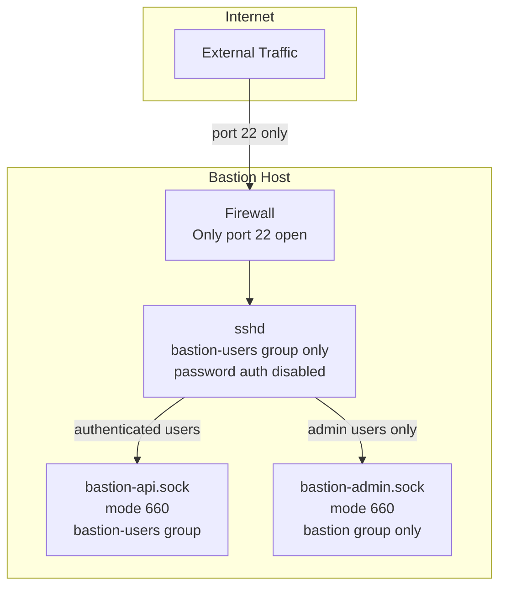
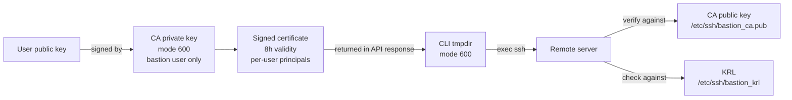

# Security

This document describes the security model, design decisions, and threat mitigations in the Bastion service.

---

## Security Principles

1. **No direct filesystem access** — human users never touch `/opt/bastion/` directly. All operations go through the API. The `bastion` system user owns everything.
2. **No standing access** — SSH certificates expire after 8 hours. There are no permanent `authorized_keys` entries on remote servers.
3. **Least privilege** — users are granted access per-server, not globally. Sudo is opt-in per access grant.
4. **Defence in depth** — multiple independent controls protect each resource.
5. **Full auditability** — every action is logged before and after execution.

---

## Network Security



- Both APIs listen on Unix sockets only — no TCP ports are exposed
- The firewall should allow only port 22 inbound
- All other ports should be blocked at the network level

---

## Authentication Security

### Password hashing

All passwords are hashed with bcrypt at cost factor 12. This is deliberately slow to resist brute-force attacks.

### JWT tokens

- Access tokens expire after 60 minutes (configurable)
- Refresh tokens expire after 7 days (configurable)
- Tokens are signed with HMAC-SHA256 using the `SECRET_KEY`
- The `SECRET_KEY` is derived into a Fernet key for encrypting secrets at rest

### MFA

Two MFA methods are supported:

| Method | Security |
|---|---|
| TOTP | Time-based one-time passwords (RFC 6238). Compatible with any authenticator app. The TOTP secret is encrypted at rest using Fernet. |
| Email | 6-digit codes with a 10-minute expiry. Codes are stored as SHA-256 hashes — the plaintext is never persisted. |

### Rate limiting

Authentication endpoints are rate-limited to 10 requests per minute per IP address (configurable). Exceeding the limit returns `429 Too Many Requests`.

### Account lockout

After repeated failed login attempts, the anomaly detection engine scores the event and may trigger an alert. Future versions will add configurable account lockout.

---

## SSH Certificate Security



- Certificates are **never written to disk** on the bastion server
- The CA private key is readable only by the `bastion` system user (mode `600`)
- Certificates expire after 8 hours — there is no permanent access
- The KRL provides immediate revocation — a revoked certificate is rejected on the next connection attempt
- Certificate principals are scoped to the specific remote username, not a wildcard

---

## Secrets at Rest

All secrets stored in the database (TOTP secrets, alert channel credentials) are encrypted using Fernet (AES-128-CBC + HMAC-SHA256). The encryption key is derived from `SECRET_KEY` using PBKDF2-HMAC-SHA256 with 600,000 iterations.

The `SECRET_KEY` itself is stored only in `/opt/bastion/.env` (mode `600`, owned by `bastion`).

---

## Session Recording Security

- Recordings are stored at `/opt/bastion/recordings/` (mode `750`, owned by `bastion`)
- If `RECORDINGS_AGE_PUBLIC_KEY` is set, recordings are encrypted with `age` (X25519 asymmetric encryption) immediately on session completion
- The plaintext recording file is securely overwritten with random bytes before deletion
- The `age` private key is never stored on the bastion host — it is held offline by the operator
- Even if the bastion host is fully compromised, recordings cannot be decrypted without the offline private key

---

## Remote Server Security

The bastion provisioning module applies the following hardening to remote servers:

```
PermitRootLogin no
PasswordAuthentication no
ChallengeResponseAuthentication no
X11Forwarding no
AllowGroups bastion-users
TrustedUserCAKeys /etc/ssh/bastion_ca.pub
```

Additionally:
- Users are created with no password (SSH cert auth only)
- Sudo is granted only where explicitly configured, using a per-user sudoers drop-in file
- The `bastion-users` group is required for SSH access

---

## Bastion Host Hardening

The install script applies the following to the bastion host's sshd:

```
PermitRootLogin prohibit-password
PasswordAuthentication no
MaxAuthTries 3
LoginGraceTime 30
X11Forwarding no
AllowGroups bastion-users root
LogLevel VERBOSE
```

Additional recommended hardening (not applied automatically):

```bash
# Disable unused services
systemctl disable --now avahi-daemon cups bluetooth

# Configure UFW
ufw default deny incoming
ufw default allow outgoing
ufw allow 22/tcp
ufw enable

# Automatic security updates
apt-get install -y unattended-upgrades
dpkg-reconfigure -plow unattended-upgrades
```

---

## Audit Trail

Every action in the system is written to the `audit_logs` table:

- Before the action is performed (with `success=false` initially)
- After the action completes (with the final `success` value)

Audit log entries are immutable — they are never updated or deleted. The table has no soft-delete mechanism.

Logged actions include:

| Action | Description |
|---|---|
| `auth.login` | Login attempt (success or failure) |
| `auth.login.mfa_required` | MFA challenge issued |
| `auth.mfa.verify` | MFA code verification |
| `auth.totp.setup` | TOTP secret generated |
| `cert.issue` | SSH certificate issued |
| `session.connect` | SSH session initiated |
| `session.connect.denied` | Access denied to a server |
| `session.terminate` | Session terminated by user |
| `admin.user.create` | User account created |
| `admin.user.update` | User account updated |
| `admin.user.suspend` | User account suspended |
| `admin.user.delete` | User account soft-deleted |
| `admin.server.onboard` | Server onboarded |
| `admin.server.access.grant` | Access grant created |
| `admin.server.access.revoke` | Access grant revoked |
| `admin.server.provision` | Provisioning task queued |
| `admin.server.reboot` | Reboot task queued |
| `admin.server.packages.update` | Package update task queued |
| `admin.cert.revoke` | Certificate revoked |

---

## Threat Model

| Threat | Mitigation |
|---|---|
| Compromised user credentials | MFA, short-lived certs, anomaly detection, account lockout |
| Stolen SSH certificate | 8h expiry, KRL revocation, cert never written to bastion disk |
| Compromised bastion host | age-encrypted recordings (offline key), CA key backup, audit log in DB |
| Privilege escalation on bastion | `bastion` user has no login shell, `NoNewPrivileges=yes` in systemd units |
| Lateral movement to remote servers | Per-user, per-server access grants, cert principals scoped to remote username |
| Insider threat | Full audit trail, session recording, anomaly detection |
| Brute force | Rate limiting, bcrypt cost 12, anomaly scoring |
| Replay attack | JWT expiry, short-lived certs, TOTP time window |
| Data exfiltration via recordings | age asymmetric encryption, offline private key |
| Denial of service | Rate limiting, Unix socket access control |

---

## Reporting Security Issues

Please report security vulnerabilities privately. Do not open public issues for security bugs.
